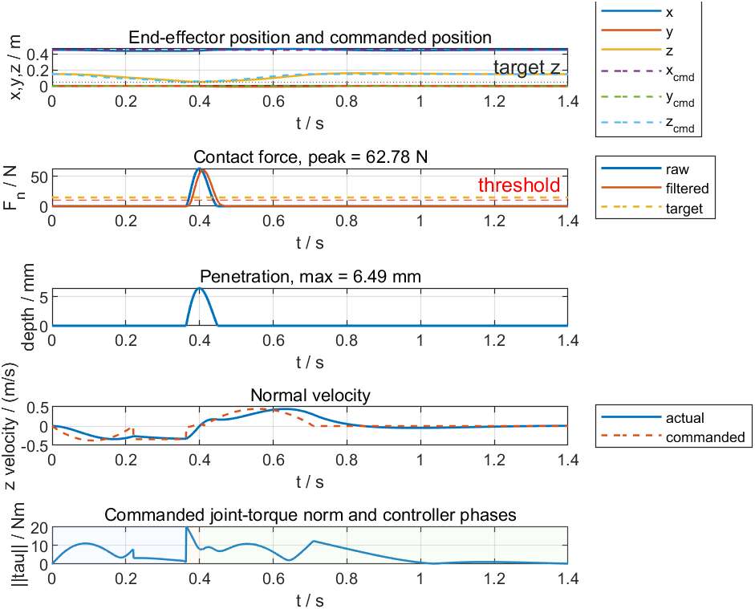
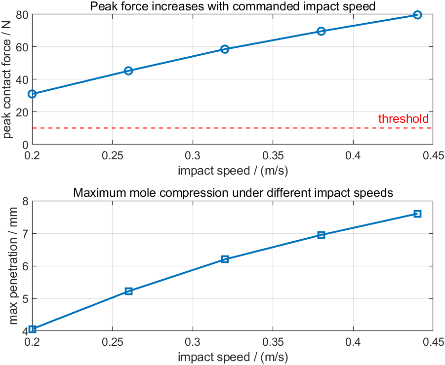
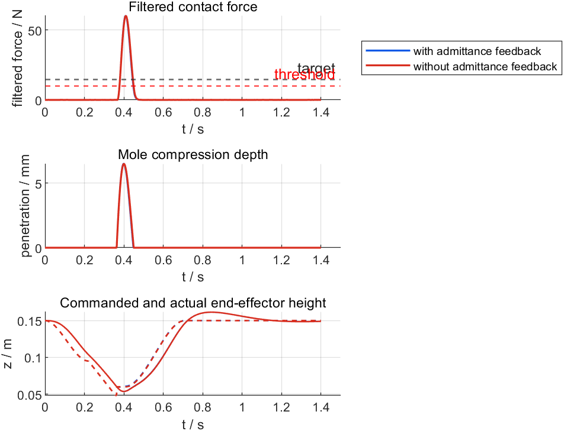
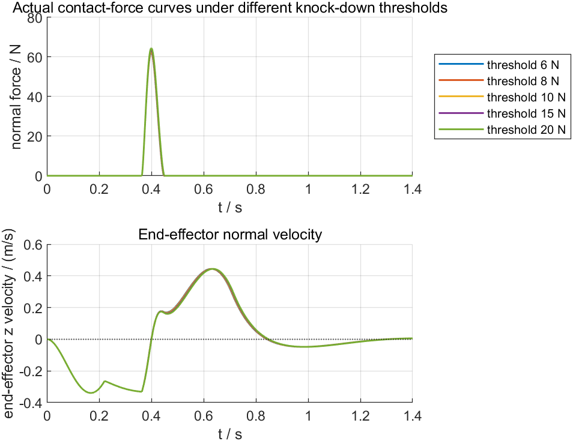
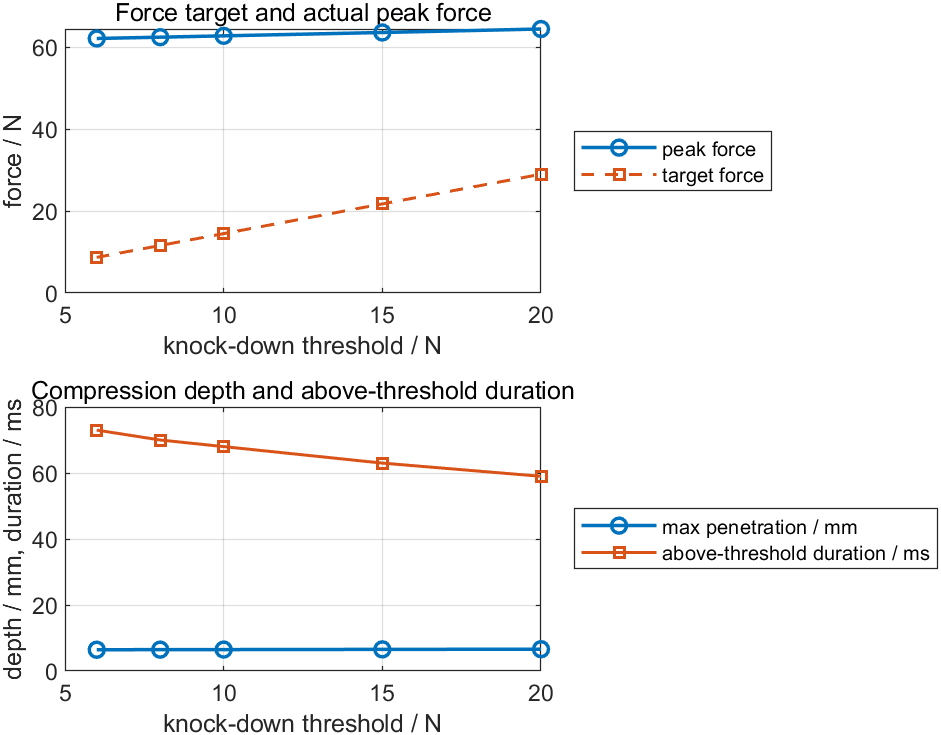

# 高速碰撞力控打地鼠实验记录

本文档记录四组用于作业报告和课堂展示的实验：

1. 单次典型敲击实验；
2. 不同敲击速度对峰值力的影响；
3. 有无接触后导纳力反馈的对比；
4. 不同击倒最小接触力阈值下的力曲线和末端速度曲线。

实验脚本：

```matlab
run("matlab/experiments/run_impact_force_experiments.m")
```

实验结果目录：

```text
matlab/experiments/results/
```

## 1. 实验设置

三组实验均固定敲击目标为目标板中心点：

```text
board = [0.000, 0.000] m
world = [0.450, 0.000, 0.050] m
```

固定目标点的原因是让不同实验之间只改变控制参数，避免目标位置、IK 解和运动路径差异影响对比结论。

默认力控参数来自：

```text
matlab/config/config_impact_force_control.m
matlab/config/config_force.m
```

关键参数如下：

| 参数 | 数值 | 说明 |
|---|---:|---|
| `cfgForce.threshold` | 10 N | 击倒判定力阈值 |
| `cfgImpact.force_target_ratio` | 1.45 | 力控目标相对阈值的比例 |
| `F_des` | 14.5 N | 接触后导纳控制目标力 |
| `cfgImpact.impact_speed` | 0.34 m/s | 默认高速下压速度 |
| `cfgImpact.admittance_gain` | 0.0014 m/(N*s) | 默认导纳反馈增益 |
| `cfgImpact.contact_model` | Hunt-Crossley | 非线性接触模型 |

输出文件包括：

```text
matlab/experiments/results/data/all_experiment_metrics.csv
matlab/experiments/results/data/all_experiment_results.mat
matlab/experiments/results/figures/exp1_typical_single_hit_detail.png
matlab/experiments/results/figures/exp2_impact_speed_sweep.png
matlab/experiments/results/figures/exp3_feedback_comparison.png
matlab/experiments/results/figures/exp4_force_threshold_sweep_curves.png
matlab/experiments/results/figures/exp4_force_threshold_sweep_summary.png
```

## 2. 实验一：单次典型敲击

实验目的：展示默认参数下，机械臂能否在高速碰撞中产生超过阈值的接触力，并通过可视化曲线说明敲击全过程。

生成图像：

```text
matlab/experiments/results/figures/exp1_typical_single_hit_detail.png
```



结果摘要：

| 指标 | 数值 |
|---|---:|
| 峰值接触力 | 62.78 N |
| 击倒阈值 | 10.00 N |
| 接触后目标力 | 14.50 N |
| 最大下压深度 | 6.49 mm |
| 接触持续时间 | 85 ms |
| 超过阈值持续时间 | 68 ms |
| 首次接触时刻 | 0.364 s |
| 成功判定时刻 | 0.389 s |
| 是否击倒 | 是 |

分析：

- 峰值接触力 `62.78 N` 明显大于 `10 N` 阈值，说明默认碰撞速度和接触模型能够产生足够击倒力。
- 最大穿透深度约 `6.49 mm`，小于配置中的最大允许下压深度 `12 mm`，说明仿真没有出现过深穿透。
- 接触持续 `85 ms`，超过阈值持续 `68 ms`，满足击倒判定所需的最小接触时间。
- 这组实验适合放在报告中作为“系统能正常完成一次力控敲击”的基准案例。

## 3. 实验二：不同敲击速度对峰值力的影响

实验目的：验证高速碰撞第一峰值力主要受碰撞速度影响。

本实验扫描以下下压速度：

```text
0.20, 0.26, 0.32, 0.38, 0.44 m/s
```

生成图像：

```text
matlab/experiments/results/figures/exp2_impact_speed_sweep.png
```



结果表：

| 敲击速度 m/s | 峰值力 N | 最大下压 mm | 接触时间 ms | 超阈值时间 ms | 是否击倒 |
|---:|---:|---:|---:|---:|---|
| 0.20 | 31.05 | 4.06 | 91 | 63 | 是 |
| 0.26 | 45.27 | 5.22 | 88 | 67 | 是 |
| 0.32 | 58.59 | 6.20 | 86 | 67 | 是 |
| 0.38 | 69.59 | 6.95 | 84 | 68 | 是 |
| 0.44 | 79.64 | 7.60 | 83 | 69 | 是 |

分析：

- 随着 `impact_speed` 从 `0.20 m/s` 增加到 `0.44 m/s`，峰值接触力从 `31.05 N` 增加到 `79.64 N`。
- 最大下压深度也从 `4.06 mm` 增加到 `7.60 mm`，说明更高的碰撞速度会带来更大的接触变形。
- 五组速度全部超过 `10 N` 击倒阈值，因此在当前接触刚度和阻尼参数下，最低 `0.20 m/s` 已经足够完成击倒。
- 这组实验支持报告中的关键结论：高速碰撞瞬间的峰值力不能主要依赖反馈调出来，而应通过碰撞速度、接触刚度、阻尼和安全限幅共同设计。

## 4. 实验三：有无导纳力反馈对比

实验目的：对比接触后启用导纳反馈与关闭导纳反馈时的力响应差异。

对比设置：

| 组别 | `admittance_gain` | 说明 |
|---|---:|---|
| with admittance feedback | 0.0014 | 默认接触后导纳力反馈 |
| without admittance feedback | 0 | 关闭接触后 z 方向导纳修正 |

生成图像：

```text
matlab/experiments/results/figures/exp3_feedback_comparison.png
```



结果表：

| 组别 | 峰值力 N | 最大下压 mm | 接触时间 ms | 超阈值时间 ms | 接触段力 RMSE N | 接触段平均滤波力 N | 是否击倒 |
|---|---:|---:|---:|---:|---:|---:|---|
| 有导纳反馈 | 62.78 | 6.49 | 85 | 68 | 27.80 | 33.47 | 是 |
| 无导纳反馈 | 62.62 | 6.48 | 86 | 69 | 27.95 | 33.73 | 是 |

分析：

- 两组峰值力几乎相同：`62.78 N` 对 `62.62 N`。这说明高速碰撞第一峰主要由预碰撞速度、接触刚度、阻尼和机械臂动态响应决定。
- 导纳反馈在检测到接触后才开始工作，并且还有传感器延迟、滤波和执行器响应，因此不应把它描述成“精确控制碰撞第一瞬间峰值力”的方法。
- 在当前默认参数下，导纳反馈使接触段力 RMSE 从 `27.95 N` 小幅降低到 `27.80 N`，平均滤波力从 `33.73 N` 小幅降低到 `33.47 N`。差异不大，原因是系统达到阈值后很快进入回撤阶段，接触保持时间较短。
- 这组实验的报告结论应写得谨慎：导纳反馈主要用于接触后的法向位置微调和安全释放；高速冲击峰值仍应主要通过速度和接触参数设计。

## 5. 实验四：击倒最小接触力阈值扫描

实验目的：按照方案 B，同时改变“击倒判定阈值”和接触后的目标力，观察实际接触力曲线与机械臂末端 z 方向速度曲线。

本实验固定：

```text
impact_speed = 0.34 m/s
admittance_gain = 0.0014 m/(N*s)
force_target_ratio = 1.45
```

扫描击倒阈值：

```text
threshold = 6, 8, 10, 15, 20 N
```

由于采用方案 B，每组接触后的目标力为：

```text
F_des = threshold * 1.45
```

生成图像：

```text
matlab/experiments/results/figures/exp4_force_threshold_sweep_curves.png
matlab/experiments/results/figures/exp4_force_threshold_sweep_summary.png
```





结果表：

| 击倒阈值 N | 目标力 N | 峰值力 N | 最大下压 mm | 接触时间 ms | 超阈值时间 ms | 成功时刻 s | 是否击倒 |
|---:|---:|---:|---:|---:|---:|---:|---|
| 6 | 8.70 | 62.14 | 6.45 | 85 | 73 | 0.387 | 是 |
| 8 | 11.60 | 62.46 | 6.47 | 85 | 70 | 0.388 | 是 |
| 10 | 14.50 | 62.78 | 6.49 | 85 | 68 | 0.389 | 是 |
| 15 | 21.75 | 63.60 | 6.55 | 86 | 63 | 0.391 | 是 |
| 20 | 29.00 | 64.46 | 6.61 | 86 | 59 | 0.393 | 是 |

分析：

- 当击倒阈值从 `6 N` 提高到 `20 N` 时，接触后目标力从 `8.70 N` 提高到 `29.00 N`。
- 实际峰值力从 `62.14 N` 小幅提高到 `64.46 N`，变化不如速度扫描明显。这说明在当前参数下，碰撞第一峰仍主要由 `impact_speed = 0.34 m/s` 的预碰撞速度决定。
- 最大下压深度从 `6.45 mm` 增加到 `6.61 mm`，说明更高目标力会让接触后导纳调节略微增加下压程度。
- 超阈值时间从 `73 ms` 降到 `59 ms`，原因是阈值线本身提高了，同一段接触力曲线超过高阈值的时间自然更短。
- 末端 z 速度曲线中，各组接触前速度基本一致；差异主要出现在接触后，较高阈值对应更高目标力，回撤/释放趋势会略有延后。

这组实验可以用来说明：当地鼠“更难打下”时，控制器会提高目标接触力，但在高速碰撞任务中，峰值力的主要来源仍然是预碰撞速度和接触参数；阈值和目标力更多影响接触后的保持、释放和成功判定。

## 6. 报告与展示建议

建议在报告中这样组织实验结论：

1. 单次典型敲击证明系统能完成“鼠标选点、轨迹规划、碰撞接触、阈值击倒、力曲线记录”的完整流程。
2. 速度扫描证明峰值力随敲击速度明显增加，说明预碰撞运动规划对冲击力大小有决定性影响。
3. 有无反馈对比证明导纳反馈不负责“瞬间峰值精确控制”，而是负责接触后的持续力调节和安全修正。
4. 击倒阈值扫描证明任务判定要求提高后，目标力和接触后速度响应会变化，但第一峰值力仍主要由预碰撞速度决定。

课堂展示时建议按以下顺序：

1. 先展示 `exp1_typical_single_hit_detail.png`，说明一次完整敲击的阶段和力曲线。
2. 再展示 `exp2_impact_speed_sweep.png`，强调速度对峰值力的影响。
3. 展示 `exp3_feedback_comparison.png`，说明力反馈的真实作用边界。
4. 展示 `exp4_force_threshold_sweep_curves.png`，说明不同击倒阈值下实际力曲线和末端速度曲线的变化。
5. 现场运行交互式程序：

```matlab
run("matlab/main_interactive_impact_force_control.m")
```

点击目标点，展示地鼠下压和实时接触力 HUD。

## 7. 可以直接引用的结论

本项目在原有位置控制打地鼠的基础上，引入了高速碰撞接触力建模和接触后导纳力反馈。实验结果表明，在默认参数下单次敲击峰值力为 `62.78 N`，明显超过 `10 N` 击倒阈值；当敲击速度由 `0.20 m/s` 增加到 `0.44 m/s` 时，峰值力由 `31.05 N` 增加到 `79.64 N`，说明预碰撞速度是影响冲击峰值力的重要因素。有无导纳反馈对峰值力影响很小，说明反馈控制主要作用于接触后的持续力调节，而不是碰撞第一瞬间的峰值力精确控制。在击倒阈值扫描实验中，阈值从 `6 N` 提高到 `20 N` 时，目标力从 `8.70 N` 提高到 `29.00 N`，峰值力从 `62.14 N` 小幅增加到 `64.46 N`，进一步说明任务阈值主要改变接触后的调节和判定，而高速冲击第一峰仍主要由预碰撞运动决定。
